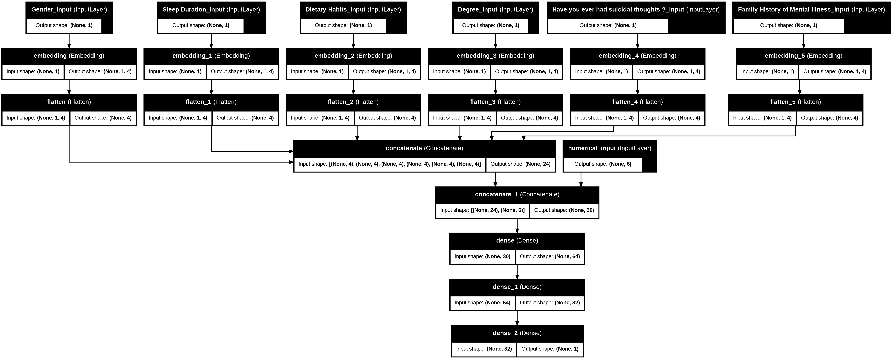

# 🧠 Early Depression Diagnosis using Deep Learning

A web-based tool powered by a Multi-Layer Perceptron (MLP) model that predicts the risk of depression in students using lifestyle, academic, and psychological inputs. This system utilizes embedded categorical features and numerical normalization, all integrated into an intuitive interface.

---

## 🚀 Features

- ⚙️ MLP model with embedded categorical features
- 📊 Uses academic, lifestyle, and mental health data
- 🌐 Web interface with visualized results and recommendations
- 🔌 REST API via FastAPI for model predictions
- 📈 Dashboard with confidence score and risk visualization
- 🏫 Designed for research at University of Greenwich (Vietnam campus)

---

## 🧠 Model Overview

- Inputs: 
  - Numerical: Age, CGPA, Academic Pressure, Study Satisfaction, etc.
  - Categorical: Gender, Sleep Duration, Dietary Habits, Degree, etc.
- Architecture:
  - Embedding layers for categorical inputs
  - Dense layers with ReLU activations
  - Sigmoid output for binary classification
- Optimizer: Adam  
- Loss: Binary Crossentropy  
- EarlyStopping for regularization

---

## 🗂 Project Structure

.
├── index.html # Frontend UI
├── model_api.py # FastAPI backend for model serving
├── DepressionDetection_code.py# Model training script
├── Depression_dectection.h5 # Saved trained model
├── model_architecture.png # Neural network diagram
├── requirements.txt # Backend dependencies
├── student_depression_dataset.csv # Source dataset, available at: https://www.kaggle.com/datasets/adilshamim8/student-depression-dataset/data

---

## 🧪 Dataset

- Source: Kaggle — [Student Depression Dataset](https://www.kaggle.com/datasets/adilshamim8/student-depression-dataset)
- Preprocessing:
  - Missing value handling
  - Standardization for numerical features
  - Label encoding for categorical variables

---

## 🖼 Interface Preview

---

## 🔍 How It Works

1. Fill out the form (e.g., GPA, sleep, stress level)
2. Click **Analyze Risk Factors**
3. View your depression risk score and recommendations

---

## 🧰 Tech Stack

- Frontend: HTML, CSS, JS
- Backend: FastAPI + TensorFlow
- Model: MLP with categorical embeddings
- Hosting: Render (or your platform)

---

## 👥 Team

- Nguyen Duy Anh  
- Nguyen Trung Hau  
- Supervisors: Nguyen Kim Khanh, Nguyen Thanh Hai

---

## 📄 License

This project is intended for educational and research purposes only.
